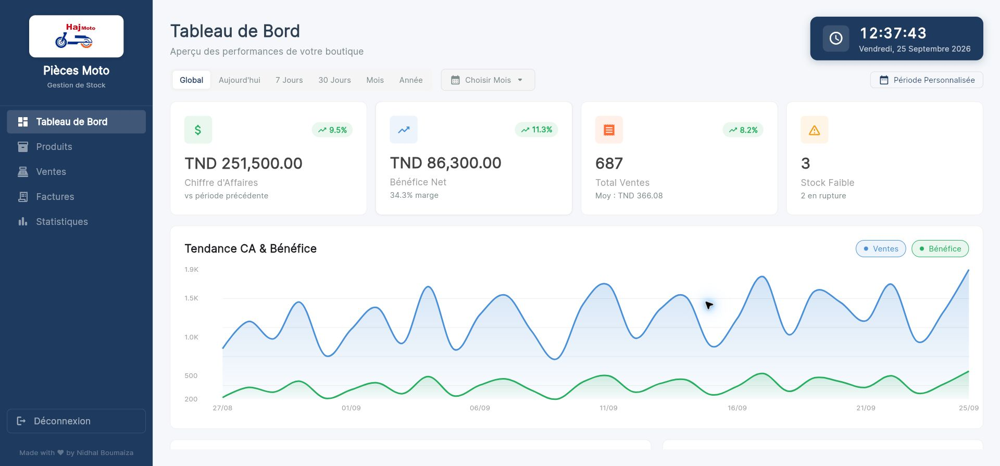

# HajMoto Stock Management

HajMoto is a Flutter inventory and sales application for motorcycle spare-parts shops. It provides a polished desktop-first workspace for products, categories, sales, invoices, and business statistics.

The repository starts in **test mode** by default, using realistic in-memory data. No database or external account is required for a portfolio demonstration.



## Features

- Product and category inventory management
- Sales workflow and invoice generation
- Dashboard metrics and charts
- Low-stock visibility
- CSV import and PDF export support
- Responsive Flutter interface for Windows and the web
- Optional Supabase production backend

## Demo Login

| Username | Password |
| --- | --- |
| `admin` | `hajmoto2024` |

These credentials are intentionally public and are only for the local showcase.

## Quick Start With Docker

1. Install Docker Desktop and make sure it is running.
2. Clone the repository:

   ```bash
   git clone https://github.com/nidhalboumaiza-0/HajMoto.git
   cd HajMoto
   ```

3. Start the ready-to-use web demo:

   ```bash
   docker compose up -d
   ```

4. Open [http://localhost:8082](http://localhost:8082) and sign in with the demo account above.

Stop the demo with:

```bash
docker compose down
```

Published image: `nidhalboumaiza28/hajmoto-web:latest`

## Run With Flutter

Requirements:

- Flutter 3.35 or newer
- Windows desktop development tools for the Windows build
- A Chromium browser for the web build

Install packages:

```bash
flutter pub get
```

Run the Windows application in test mode:

```bash
flutter run -d windows
```

Run the web application in test mode:

```bash
flutter run -d chrome
```

Test mode is the default, so no environment file or database setup is needed.

## Production Configuration

Production mode uses compile-time Dart defines. Create an untracked `config.production.json` file:

```json
{
  "APP_ENV": "production",
  "SUPABASE_URL": "https://your-project.supabase.co",
  "SUPABASE_ANON_KEY": "your-publishable-key"
}
```

Run with Supabase enabled:

```bash
flutter run -d windows --dart-define-from-file=config.production.json
```

The application validates the required Supabase values before startup. Never commit service-role keys or other private credentials.

## Verification

```bash
flutter analyze
flutter test
flutter build web --release
```

## Project Structure

```text
lib/core/       Configuration, theme, dependency injection, and shared UI
lib/features/   Auth, dashboard, inventory, categories, and sales modules
assets/         Product branding and application icons
web/            Flutter web host files
windows/        Windows desktop runner
```

The codebase follows feature-oriented clean architecture with BLoC state management and repository abstractions for mock and Supabase data sources.
